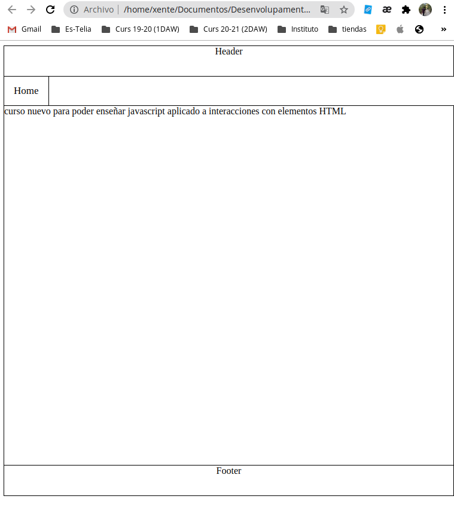

# PRACTICA 1. SISTEMAS DE CONTROL DE VERSIONES.
## Vicente Andani Auñón


`¿Qué es git y para qué sirve?`

GIT es un software de control de versiones diseñado por Linus Torvalds, pensando en la eficiencia y la confiabilidad del mantenimiento de versiones de aplicaciones cuando éstas tienen un gran número de archivos de código fuente. Su propósito es llevar registro de los cambios en archivos de computadora y coordinar el trabajo que varias personas realizan sobre archivos compartidos.

`¿Qué es la metodología GIT FLOW?`

Git-flow es un conjunto de extensiones para Git, basado en el modelo de ramificaciones de Vincent Driessen, que nos facilita el trabajo con nuestros repositorios. Git-Flow agrega comandos de alto nivel que, por detrás, usan los comandos tradicionales de Git.

`Porque se utiliza en nuestro desarrollo`

Git Flow te permite dividir tu proyecto en varias ramas de desarrollo dedicadas a tareas muy específicas de tu proyecto. 
Define un modelo de ramificación estricto, diseñado alrededor del proyecto. Esto proporciona un marco robusto para gestionar proyectos más grandes.

`Objetivo de la práctica`

En esta práctica el objetivo es saber utilizar y crear ramas. En esta práctica tendremos 3 usuarios que estan realizando una web. Yo personalmente he utilizado la metodología **Git-Flow**.

## 1 - Configuración del terminal.

Para que aparezca la rama donde me encuentro he configurado el terminal realizando este [Tutorial](https://medium.com/@thucnc/how-to-show-current-git-branch-with-colors-in-bash-prompt-380d05a24745)

## 2 - Creación y configuración del repositorio con las ramas master y develop. (user1)

### 2.1 - Init del repositorio.

Realizamos un init del repositorio de GitHub y subimos los cambios a la rama master.


### 2.2 - Inicializar el repositorio con git flow.

Seguidamente introducimos el siguiente comando:

```
git flow init
```

Dejamos todos los campos por defecto, esto creará la rama develop.


Una vez inicializado el repositorio con git flow hacemos un push a develop para que se suba a github.

```
git push -u origin develop
```

```
git push branch -a
```


## 3 - Creación de la primera feature (home) por el usuario 1.

### 3.1 - Creación de la rama y del html.

Primero utilizamos git flow para crear la rama feature/home

```
git flow feature start home
```


Ahora procedemos a crear el home (html y css)




### 3.2 - Subimos la rama home y finalizamos la feature.

```
git add .
```

```
git status
```

```
git commit -m"Home creado y estructura"
```

```
git push -u origin feature/home
```


Ahora finalizamos la feature.

```
git checkout develop
```

```
git flow feature finish home
```


Ahora subimos los cambios a la rama develop.

```
git push -u origin develop
```


### 3.3 - Creacion de la release 1.0.0

Ahora vamos a crear una release para los cambios. Ya que hemos comprobado que todo funciona bien.

Seguidamente la subiremos a master.

```
git flow release start 1.0.0
```


```
git push origin release/1.0.0
```


Y finalizamos la release 1.0.0 (subiendola a master y a develop)

```
git flow release finish 1.0.0
```

```
git push -u origin master
```

```
git push
```


## 4 - Inicialización del usuario 2.

### 4.1 - Clone del repositorio y git flow init

Realizamos un clone del repositorio y lo inicializamos con git flow

```
git clone x user2
```

```
git flow init
```


### 4.2 - Creación de la feature 2 (contenidoHTML) (user2).

```
git flow feature start contenidoHTML
```

Creamos tambien los archivos necesarios y modificamos el home (creado por el user 1) añadiendo la nueva opción en el menu.


### 4.3 - Subimos la rama contenidoHTML y finalizamos la feature.

```
git add .
```

```
git status
```

```
git commit -m"contenidoHTML creado y modificado el home con un link"
```

```
git push -u origin feature/contenidoHTML
```


Ahora la finalizamos y la subimos a develop.

```
git checkout develop
```

```
git flow feature finish contenidoHTML
```

```
git push -u origin develop
```


### 4.4 - Creación de la feature 3 (atributosHTML) (user2).

```
git flow feature start atributosHTML
```

Y ahora creamos el HTML y modificamos el home para añadir el boton en el menu. (tambien modificamos el html de contenidoHTML)


### 4.5 - Subimos la la rama feature/atributosHTML y la finalizamos

```
git add .
```

```
git status
```

```
git commit -m"AtributosHTML añadido y home modificado"
```

```
git push -u origin feature/atributosHTML
```


Ahora finalizamos la feature


### 4.6 - Creacion de la release 2.0.0 (con las dos features del usuario 2)

```
git flow release start 2.0.0
```


Ahora subimos la release 2.0.0 para que la puedan ver todos los usuarios.


Ahora la finalizamos y la subimos a master.

```
git checkout master
```

```
git flow release finish 2.0.0
```


```
git push -u origin master
```


## 5 - Inicialización del usuario 3.

### 5.1 - Clone del repositorio y git flow init

Realizamos un clone del repositorio y lo inicializamos con git flow

```
git clone x user2
```

```
git flow init
```


### 5.2 - Creación de la feature 4 (estilosCSS) (user3).

```
git flow feature start estilosCSS
```


Y realizamos el html de estilosCSS y ponemos los links en los otros archivos.


Subimos la feature

```
git add .
```

```
git commit -m"Subimos la feature estilosCSS"
```

```
git push -u origin feature/estilosCSS
```


### 5.3 - Finalizamos feature estilosCSS

```
git checkout develop
```

```
git flow feature finish estilosCSS
```

```
git push -u origin develop
```


### 5.4 - Creacion release 3.0.0 (con la feature del user 3)

```
git flow release start 3.0.0
```


```
git push -u origin release/3.0.0
```


Ahora la finalizamos y la subimos a master

```
git flow release finish 3.0.0
```

```
git checkout master
```

```
git push -u origin master
```


Y la subimos tambien a develop para que actualize

```
git checkout develop
```

```
git push -u origin develop
```


## 6 - HotFix mejora v3.0.1 (usuario 1)

Primero tenemos que hacer un PULL en la carpeta del usuario 1 para actualizar el repo local.


### 6.1 - Creamos el hotfix

```
git checkout master
```

```
git flow hotfix start mejoraV3.0.1
```


### 6.2 - Realizamos el cambio (en modify_atributo.html)

Subimos los cambios realizados al hotfix.

```
git push -u origin hotfix/mejoraV3.0.1
```


### 6.3 - Finalizamos el hotfix y lo publicamos.

```
git checkout master
```

```
git flow hotfix finish mejoraV3.0.1
```


```
git push -u origin develop
```

```
git checkout master
```

```
git push -u origin master
```


## 7 - GitHub Page

https://vicnx.github.io/practica_desplegament/


